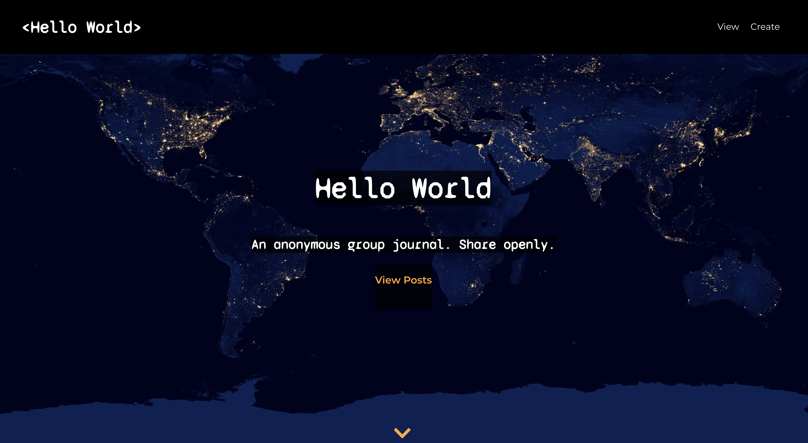

# Hello World API

## Summary:

This server-side project was built along with a client-side React app, which can be viewed [here](https://github.com/tatia-burdett/hello-world-app). The app was deployed through Heroku. 

## Tech Details:

This project was created with:
* Node.js
* Express
* PostgreSQL

## See it live:

[Live link](https://hello-world-app-tatia-burdett.vercel.app)

## REST API - Endpoints

* GET & POST - /api/comment
* PATCH & DELETE - /api/comment/:id

## Screenshots

### Landing Page

### Posts Page

### Single Post Page

### Post Form Page
